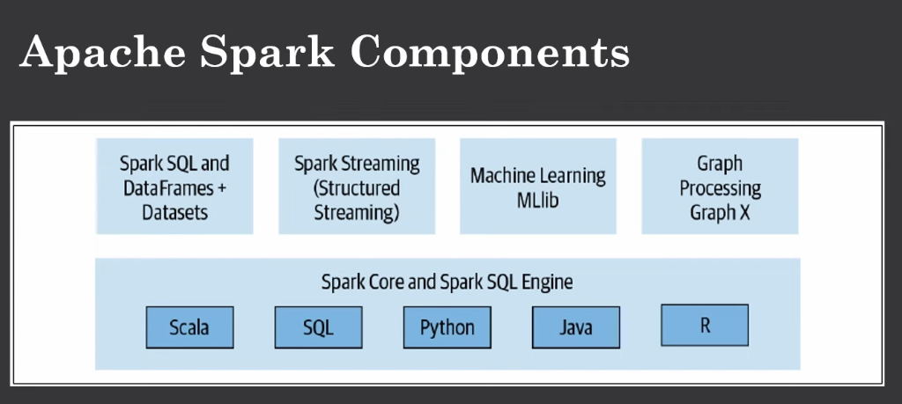

## Apache Spark
Apache Spark is a in-memory data processing framework designed for large-scale distrubuted data processing.
It is way faster than Hadoop MapReduce.

- It incorporates libraries with composable APIs like
1. MLlib
2. Spark SQL
3. Structured Streaming
4. GraphX

### Spark Characterstics
* Speed
    - Due to in-memory, speed 
    - Parallel processing
    - DAG
* Ease of use 
    - Reasiliant applications
* Modularity
    - All the worker nodes will run under one engine
* Extensibility

---

### Apache Spark Components

These are the major components of Apache Spark. Let's discuss them one by one.

As shown in this figure, Spark offers you four distinct components:

1. **Spark SQL**
2. **MLlib**
3. **Structured Streaming**
4. **GraphX**

Each of these components is separate from the Spark Core engine. In the core engine, you will write your Spark application, and Spark will convert it into a Direct Acyclic Graph (DAG). This DAG is then executed by the core engine. 

You can write your code using Java, Scala, or Python. Regardless of the programming language used, the underlying code is decomposed into highly compact bytecode, which is then executed on the worker nodes across the cluster.

1. Spark SQL
The first component is Spark SQL. Spark SQL deals with structured data. As the name suggests, Spark SQL allows you to submit SQL queries on top of the data, which must have a specific structure. You can read data stored in any RDBMS table or from different file formats like text, JSON, CSV, and Parquet, which is a very popular data format. You can construct permanent or temporary tables in Spark. You can use different languages and combine SQL-like queries to query your Spark DataFrame. The good news is that Spark SQL is ANSI SQL compliant, so if you know SQL, you can use Spark SQL effectively.

2. MLlib
The next component is MLlib. Spark provides a library containing machine learning algorithms called MLlib. MLlib offers many popular machine learning algorithms built on top of the high-level DataFrame architecture to build your models. This MLlib API allows you to extract or transform features and build pipelines for training and evaluation of your models. It also supports persisting models for saving and reloading them during deployment stages. This library is very powerful and will be discussed at the end of this course because it is a more advanced topic. You need to build your basics first before moving on to advanced topics like machine learning and graph processing.

3. Structured Streaming
The next component is Structured Streaming. The requirement for big data developers is to combine real-time and static data from engines like Apache Kafka and other streaming sources. This tool is used for data coming in real-time from various sources, such as Apache Kafka. It is used for processing web logs, recommendation engines, and data from IoT devices. These are some use cases for the Spark Streaming API.

4. GraphX
The last component is GraphX. As the name suggests, this library is used for manipulating graphs. The graph could be of many types, like social network graphs, routes and connection points, and network topology. GraphX offers standard graph algorithms for analyzing connections and traversals. It includes different algorithms like PageRank, connected components, and triangle counting. This is also an advanced topic and will be discussed once we complete our core topics like Spark SQL and Spark Streaming.

----

So as we have discussed already till now, you know that Spark is a distributed data processing framework. Before we explore the programming aspect of it, we have to first understand how all these components tie together and provide a distributed architecture and what the deployment models are available.

So now let's talk about the high-level architecture of Apache Spark. At a high level, it consists of a driver program which is responsible for orchestrating the parallel operation on the Spark cluster. The driver accesses the distributed components in the cluster and executes them through the Spark session.

Now, this one will be your Spark application. We will give it the name "Spark app." In a Spark application, you have two major components: the Spark driver and a Spark session. Here we have the Spark driver and the Spark session, which is the entry point of every Spark application. You have the Spark session.

Okay, so this is your Spark application. For the Spark driver, it is a part of the Spark application responsible for starting a Spark session. The driver has multiple roles, such as requesting resources like CPU and memory needed to perform operations from the cluster manager for the Spark executors. It also transforms all the operations into a DAG computation, which we have just discussed, and it handles all the scheduling tasks and distributes them across your cluster.

The cluster consists of different Spark executors. Here, let's say this is one Spark executor, and here comes another one. This is executor one and this will be executor two. The orchestration between them is done by the cluster manager, which is a major component in the Spark architecture.

So here, you have the cluster manager. The Spark driver first communicates with the cluster manager to negotiate how many resources are required to perform a certain kind of operation. The cluster manager then communicates with both executors to determine who is available. According to that, it takes action and tells the Spark driver to submit the task to these different executors. Executors are commodity hardware running in parallel to execute the job, which means that the Spark application is connected with all the executors in your cluster.

This is how the Spark job works - on a high-level

**Overview of the High-level architecture**
At a high level, Spark consists of a driver program which is responsible for orchestrating parallel operations on the Spark cluster. The driver accesses the distributed components in the cluster and executes them through the Spark session. This forms your Spark application, which we will refer to as the "Spark app."

In a Spark application, there are two major components:

1. Spark Driver
2. Spark Session

#### 1.1 Spark Driver
The Spark driver is part of the Spark application and is responsible for starting a Spark session. The driver has multiple roles:

1. **Requesting Resources**: The driver requests the necessary resources (CPU and memory) from the cluster manager for the Spark executors.
2. **DAG Computation**: It transforms all operations into a Directed Acyclic Graph (DAG) computation.
3. **Scheduling Tasks**: The driver schedules tasks and distributes them across the cluster.

#### 1.2. Cluster Manager: 
The cluster is made up of different Spark executors. The orchestration between the Spark driver and executors is managed by the cluster manager, a major component in the Spark architecture. The process involves the following steps:

- The Spark driver communicates with the cluster manager to negotiate the required resources.
- The cluster manager communicates with the executors to determine resource availability.
- Based on availability, the cluster manager instructs the Spark driver to submit tasks to the appropriate executors.

#### 1.3. Spark Executors
Executors are the commodity hardware that run in parallel to execute tasks. The Spark application is connected to all the executors in the cluster, which work together to complete the job.

Here’s a simplified representation of the architecture:

1.1 Spark Driver

* Starts a Spark session
* Requests resources from the cluster manager
* Transforms operations into a DAG computation
* Schedules and distributes tasks

1.2. Cluster Manager

* Negotiates resource allocation
* Communicates with executors

1.3. Spark Executors

* Execute tasks in parallel
* Report results back to the driver
----

#### 2.Spark Session

Let's discuss what a Spark session is. As I already mentioned, it's the entry point of every Spark application and has become a unified process for all Spark operations. Through this one process, you can:

- Create and define DataFrames and datasets.
- Read and write data from different sources across the cluster.
- Access catalog metadata.
- Issue Spark SQL queries.

The Spark session provides a single unified entry point for all these Spark functionalities, which is why it is considered the entry point of every Spark application. In a standalone Spark application, you can create a Spark session using the high-level API in any programming language we have discussed in previous topics.

#### Cluster Manager

Now, let's discuss the cluster manager. It is responsible for managing and allocating resources for the cluster of nodes present in your architecture. In the figure, we have only two executors, but in the real world, there could be hundreds of executors. 

As of now, Spark supports four cluster managers:
1. **Built-in Standalone**
2. **Apache Hadoop YARN**
3. **Apache Mesos**
4. **Kubernetes**

We will discuss them in greater detail. At a high level, cluster managers handle the negotiation and submission of your job on the cluster.

#### Spark Executor

Next, let's discuss the Spark executor. Executors do all the groundwork and process your data using in-memory computation. A Spark executor runs on every worker node in the cluster and communicates with the driver program, which is responsible for executing the tasks.

#### Deployment Models

Now, let's discuss a high-level understanding of the deployment models. A very good feature of Apache Spark is its support for different deployment models, enabling Spark to run on different configurations and environments. As mentioned earlier, Spark can run on your local machine, on the cloud, or on-premise. You can use different deployment models as per your need:

- **Local Deployment**: Ideal for small datasets, allowing you to run Spark locally.
- **YARN (Yet Another Resource Negotiator)**: Used when you have commodity hardware working together in parallel.
- **Kubernetes**: Suitable for containerized environments.
- **Standalone Mode**: Can run on any node of the cluster.

This is how the Spark architecture works to run and execute your processes.

-----

### Basic Concepts in Spark Application

To understand some basic concepts of every Spark application is crucial because it provides insight into what is happening under the hood with our Spark code. Familiarity with key concepts of a Spark application is essential. Here are some key concepts:

**Application**
The application is essentially a user program built on Spark using its APIs. There are different APIs discussed in previous lectures. It consists of a driver program and executors on the cluster. A user program built on Spark using its APIs, consisting of a driver program and executors on the cluster.

**Spark Session**: The entry point of every Spark application, allowing programming Spark with various APIs. While Spark driver instantiates a Spark session in the Spark shell, during a Spark application, you must create your Spark session object.

**Job**: A parallel computation consisting of multiple tasks distributed in response to a Spark action. Actions and transformations play significant roles in defining jobs.

**Stage**: Intermediate steps between transformations and actions, representing a set of tasks that can be executed together. Wide transformations delineate the boundary between stages.

**Task**: A unit of work sent to the Spark executor, each comprising tasks executed across the cluster.
Spark Application and Execution Flow

At the core of every Spark application lies the driver program, which creates a Spark session object. This session serves as the entry point, enabling submission of jobs to various executors across the cluster. Orchestrated by the cluster manager, the Spark driver converts the application into one or more Spark jobs, each containing multiple stages and tasks.

**Lazy Evaluation**
Spark operations on distributed data fall into two types: transformations and actions.

**Transformations**: These transform one DataFrame to another without altering the original data, providing immutability. Operations such as select or filter return transformed results into new DataFrames. Transformations are evaluated lazily, recording lineage for later execution.
Actions: Actions trigger the computation of transformations, converting them into a directed acyclic graph (DAG) and executing them. Examples include count, collect, or save.

**Types of Transformation**

Transformations can be narrow or wide.

1. Narrow Transformation: Computed from a single input partition, producing a single output partition without data exchange. Examples include select or filter.
2. Wide Transformation: Involves data exchange between partitions, like group by or order by. These operations can be resource-intensive and impact performance.

---

#### Spark UI
Spark UI is a crucial topic, and you might have already encountered it in our installation video. Spark incorporates a Graphical User Interface (GUI), known as Spark UI, which serves as a tool for inspecting and monitoring your Spark application.

**Features of Spark UI**

In Spark UI, you can inspect and monitor various stages of your Spark application, including jobs, stages, and tasks. Depending on your Spark deployment, the driver launches the web UI, typically running on port 4040 by default.

**Metrics Displayed in Spark UI**

Spark UI provides a comprehensive set of metrics, including:

- Scheduler tasks, stages, and the tasks assigned to them.
- Summary of RDD size and memory consumption.
- Information about the environment and running executors.
- Display of Spark SQL queries, if utilized.

**Benefits of Spark UI**

Spark UI offers a holistic view of your application, allowing you to easily monitor submitted jobs, executed or running jobs, as well as any failed jobs. It provides valuable insights into how your application is performing on your cluster.
